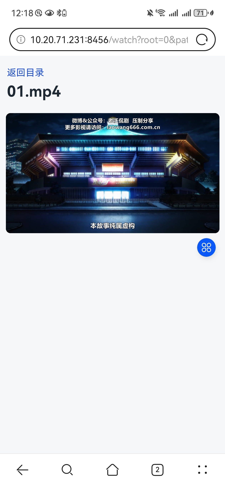
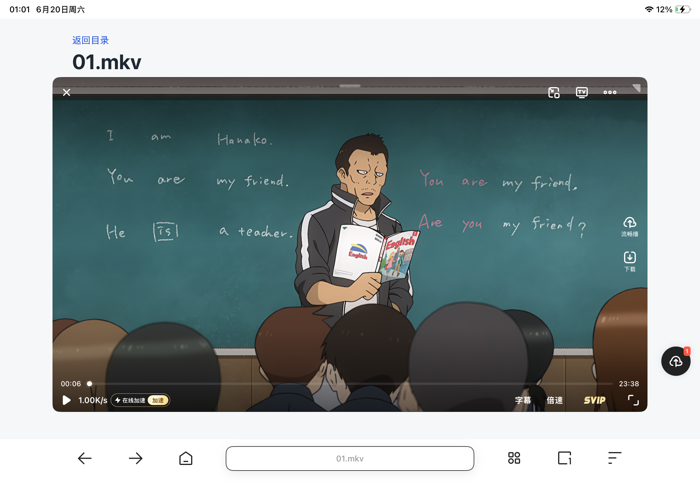

# localmovie

通过局域网在手机/平板上浏览本地电脑视频

|  |  |  |
| :--------: | :--------: | :-----------------: |

## 使用

首先修改 `config.ini`，把 `[video] directories` 改为你需要映射的视频目录；如有多个目录，使用英文逗号 `,` 分隔。

本项目运行无需额外第三方库，执行 `python main.py`

```bash
$ python main.py

  本机访问:   http://127.0.0.1:8456/
  局域网访问: http://10.20.71.231:8456/

  按 Ctrl+C 停止服务
```

在手机或平板浏览器中打开程序输出的局域网访问地址即可。

> 需要保持电脑和手机/平板位于同一个局域网/Wi-Fi 下
> 
> 如果附近没有局域网也可以手机开热点给电脑使用，它们也是一个局域网。

页面会按原始文件夹结构展示目录和视频文件。目录内容按名称字典序排序，播放视频时支持浏览器拖动进度条。

全屏视频后长按加速，调节音量等属于浏览器内置的视频播放器的功能支持，功能较为复杂与本项目无关

## 相关问题补充说明

### 点击播放卡住？

项目已经使用 `preload="metadata"`，并且 `/video` 接口支持 HTTP Range 分段传输。

但是有一些 MP4 点击后直接卡住，需要等待很久才出现画面，并且在日志中可以看到 `206`，说明浏览器正在按片段读取视频，不是在一次性下载完整文件。

这是因为这些 **mp4 文件的格式并不规范**，片段比较琐碎，导致需要缓存完整的mp4文件才能找到第一帧播放，笔者这里提供了一个py脚本用于修复相应的 mp4 文件

> 首先确保你的环境中已经安装了 ffmpeg

```bash
python tools/check_remux_mp4.py "G:\video"
```

该脚本会使用 "-movflags+faststart" 覆盖修复 mp4 文件，默认会处理某个目录及所有子目录下的所有 mp4 文件

该脚本默认是 dry-run，只会打印建议，不会修改文件。确认无误后可以真正执行重封装：

```bash
python tools/check_remux_mp4.py "G:\video" --apply
```

### 浏览器无法全屏播放 mkv？

这个和你**使用的浏览器有关系**，大部分浏览器都无法原生支持 mkv 格式的播放，个人亲测华为浏览器，Google，Safari 浏览器都无法直接播放 mkv 文件，建议使用**夸克浏览器**

> 笔者网盘下载下来的很多都是 mkv 格式

因为 MKV 只是容器，里面可能是 H.264、H.265/HEVC、AV1、VP9、AAC、AC3、DTS、Opus 等不同编码。浏览器对 MKV 的支持不如 MP4 稳定，部分浏览器可能出现窗口播放正常、全屏黑屏或只有声音的情况。

当然如果方便的话可以使用 ffmpeg 将其转换为 mp4 

### srt 字幕文件可以识别么？

可以，会自动加载对应的字幕文件
